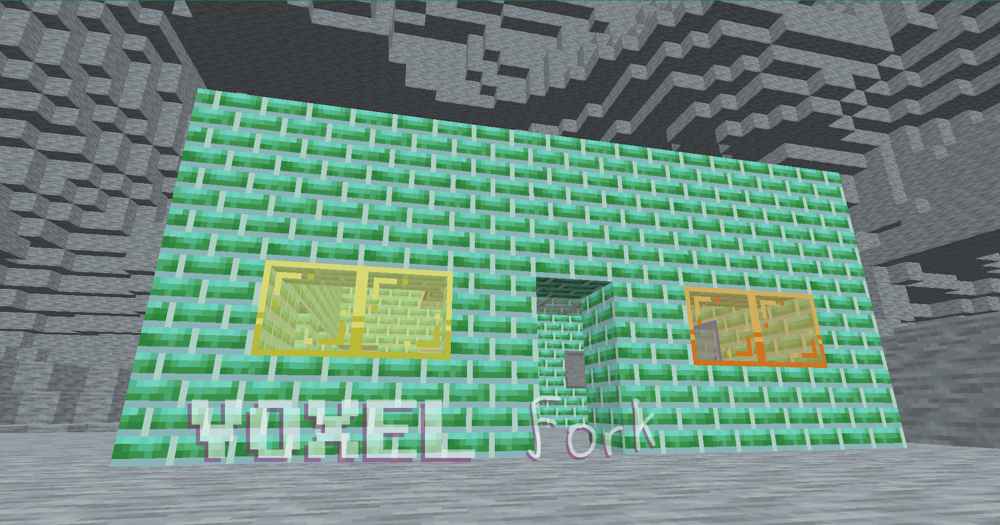

## Your generic barebones clone of a really popular block game
Nothing much here yet, huh? What will this be? Well, it is heading towards being some sort of standalone version of [Diverge](https://github.com/BlueStaggo/MCDiverge), a mod created by the same author as this random, uhh, voxel thing. A couple other people are helping out as well by taking inspiration from their idea of a game (called Player 11 for some reason). This game might feature furry content, like how [DangerZone](https://orespawn.com) has anti-vax content, who knows? Voxel Thing will feature multiplayer and it will be free to play if it turns into a full on game.

## Controls
- WASD: Fly around
- Move mouse: Look around
- Space: Jump
- 1-9: Select block
- Left click: Place block
- Right click: Break block
- E: Inventory
- Q: No-clip
- R: Teleport to a random position
- F: Halve fog distance
- Shift + F: Double fog distance
- F1: Toggle GUI
- F3: Debug menu
- F4: Toggle view bobbing
- F5: Third person
- F6: Change skin
- Middle click: Lock / unlock mouse
- ]: Increase GUI scale
- [: Decrease GUI scale
- Escape: Quit game