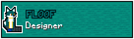

## Controls
- WASD: Fly around
- Move mouse: Look around
- Space: Jump
- Double Space: Fly
- Shift: Fly down
- 1-9: Select block
- Left click: Place block
- Right click: Break block
- E: Inventory
- Q: No-clip
- R: Teleport to a random position
- F1: Toggle GUI
- F3: Debug menu
- F5: Toggle third person
- Escape: Open pause menu

## Play
Download [the latest release](https://github.com/shinevee/VoxelFork/releases/latest) & run the jar*

*Java 17 or later is required to run Voxel Fork.

## Voxel Thing Credits

[//]: # (![TALON: Just a cool guy ig]&#40;doc/credits/talon.png&#41;)
